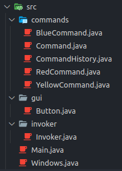
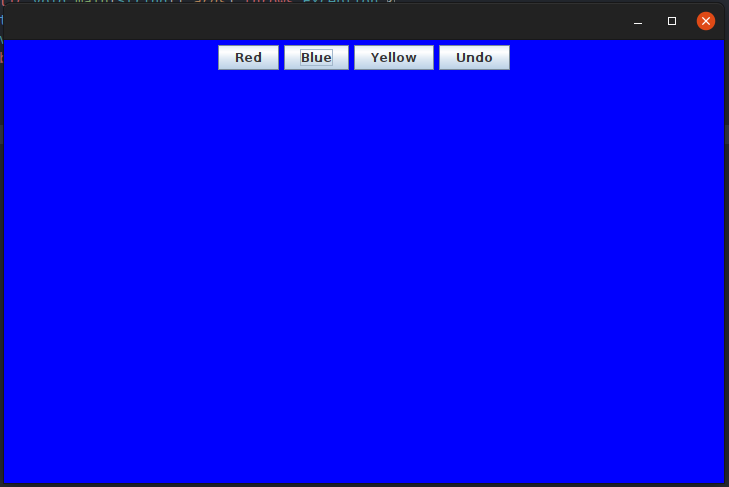

## Design-patterns - Command

In this exercise you will create a java swing application and implement the Command design pattern in order to be able to change the background color of the application to RED / BLUE / YELLOW.
This application will also be provided with a history of orders made to be able to cancel the previous order at any time.

The git repo has 3 branches

- easy ( fill-in-the-blank code )
- hard ( you have to create everything from scratch )
- main ( solution of the exercise )

# Instructions

###### The file architecture should look like the sreen below at the end of the lab



1. Complete the TODOs in :

- `Command.java`
- `CommandHistory.java`
- `Invoker.java`

2. Add 3 commands :

- `BlueCommand.java` ( Change receiver background to blue )
- `RedCommand.java` ( Change receiver background to red )
- `YellowCommand.java` ( Change receiver background to yellow )

`RedCommand` / `YellowCommand` create a backup in the history but not `BlueCommand`

2. Execute the application

```bash
java -D -cp bin App
```


